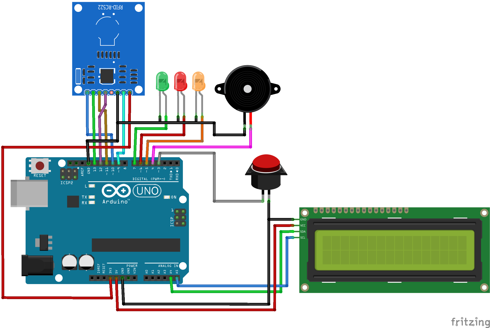

# ID Card Recoginition
This Arduino-based project uses an RFID RC522 module to scan and recognize ID cards. The system allows card registration, recognition, and access control, complete with LED indicators, LCD display, and buzzer feedback. It supports multiple cards, distinguishes between authorized and unauthorized users, and provides real-time access status.

  

 
---

## Features
- ✅ Register new RFID cards using a button
- 🔒 Grant access only to registered cards
- 💾 Card data stored in RAM (lost on power off)
- 📟 LCD 16x2 (I2C) for status display
- 🔊 Buzzer with different sounds for access granted or denied
- 🔴🟡🟢 LEDs for status indicators:
  - Red: Access Denied
  - Green: Access Granted
  - Yellow: Standby (waiting for card)

---

## 🧰 Components

| Component            | Qty | Notes                           |
|----------------------|-----|----------------------------------|
| Arduino UNO          | 1   | Main microcontroller            |
| RFID RC522 Module    | 1   | Card reader                     |
| LCD 16x2 I2C         | 1   | Status display                  |
| Buzzer (active)      | 1   | Beep sound                      |
| LEDs (Red, Green, Yellow) | 3 | Status indicators             |
| Resistors 220Ω       | 3   | For LEDs                        |
| Push Button (DPDT)   | 1   | For registration mode           |
| Breadboard & Wires   | -   | Wiring and prototyping          |

---

## 🔌 Pin Configuration

### 📚 RFID RC522 → Arduino

| RC522 | Arduino UNO |
|-------|-------------|
| SDA   | D10         |
| SCK   | D13         |
| MOSI  | D11         |
| MISO  | D12         |
| RST   | D9          |
| 3.3V  | 3.3V        |
| GND   | GND         |

### 🔔 Buzzer

- Buzzer → D3 (Low-level trigger)

### 💡 LEDs

| LED     | Arduino |
|---------|---------|
| Red     | D4      |
| Yellow  | D5      |
| Green   | D6      |

### 🖲️ Registration Button

- COM → GND  
- NO  → D7 (use `INPUT_PULLUP`)

### 📟 LCD I2C

- SDA → A4  
- SCL → A5  

---

## 🧠 Program Flow

1. **Idle (no card):**  
   - Yellow LED ON  
   - LCD: “Scan Card...”  
   - Buzzer OFF

2. **Registration Mode (button pressed):**  
   - New card will be saved (if not already registered and space available)

3. **Card recognized:**  
   - Green LED ON  
   - Buzzer: BEEP BEEP  
   - LCD: Access Granted

4. **Card not recognized:**  
   - Red LED ON  
   - Buzzer: BEEEEEEP  
   - LCD: Access Denied

---

## ⚠️ Notes

- UID data is only stored in RAM.
- Once Arduino is powered off, all registered cards are lost.
- Use EEPROM or MicroSD to make the data persistent.

---

## 📷 Project Preview

> _(You can insert your project photos here)_

---

## 🔧 Future Improvements

- [ ] Save UID to EEPROM for persistence
- [ ] Add card removal feature
- [ ] Encrypt UID for better security

---

## 📄 License

This project is open-source and free to modify for educational or development purposes.

---
